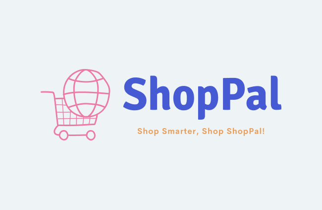

    
    <h1>ShopPal - Shop Smarter, Shop ShopPal!</h1>
    <h3>
        <a href="https://shoppal-ui.netlify.app/" color="white">
        Live
        </a>
         | 
        <a href="./assets/preview.mp4">
        Video (WIP)
        </a>
    </h3>

    An Online E-Commerce Platform For All Your Shopping Needs!

---

## 🧐 Introduction 

**ShopPal** is a full-stack e-commerce web application developed by **Sagar Kumar Sah** as a portfolio project. It offers a modern and responsive online shopping experience featuring fake product listings across categories like clothing, electronics, and home goods.

This project demonstrates end-to-end skills in modern frontend and backend development, authentication, CRUD operations, and deployment.

---

## ⛏️ Technologies Used

<table>
    <thead>
        <tr>
            <th>Property</th>
            <th>Badges</th>
        </tr>
    </thead>
    <tbody>
        <tr>
            <td>🖥️ Front-End</td>
            <td>
                
                
                
                
                
                
                
                
            </td>
        </tr>
        <tr>
            <td>📡 Back-End</td>
            <td>
                
                
                
                
                
            </td>
        </tr>
        <tr>
            <td>🗄️ Database</td>
            <td>
                
                
            </td>
        </tr>
        <tr>
            <td>🚀 Runtime Environment</td>
            <td>
                
                
            </td>
        </tr>
        <tr>
            <td>☁️ Hosting</td>
            <td>
                
                
            </td>
        </tr>
    </tbody>
</table>

---

## 🎈 Features 

- ✅ **Login/Sign Up** with JWT authentication  
- ✅ **Product browsing** with search, filters, and categories  
- ✅ **Rating and review** system for products  
- ✅ **Cart** with add/remove and live quantity update  
- ✅ **Checkout** with fake payment integration  
- ✅ **Order history** per user  
- ✅ **User profile** with editable info  
- ✅ **Fully responsive** on all devices  

---

## 🙏 Acknowledgements 

- 🎨 [**Looka**](https://looka.com/) - Logo Design  
- 🎨 [**Realtime Colors**](https://www.realtimecolors.com/) - Color palette  
- 🧩 [**IconScout**](https://iconscout.com/) - Lottie animations & vectors  
- 🧩 [**React SVG Icons**](https://reactsvgicons.com/) - Icons used across the UI  

---

## 🎉 Author 

Made with ❤️ by  
**Sagar Kumar Sah**  
📍 Araria, Bihar | 👨‍🎓 B.Tech CSE (M.M. Engineering College, Mullana)  
🔗 [GitHub Profile](https://github.com/sagarkumarsah)

---

## 📄 License 

This project is licensed under the **MIT License** – see the [LICENSE](LICENSE) file for details.
